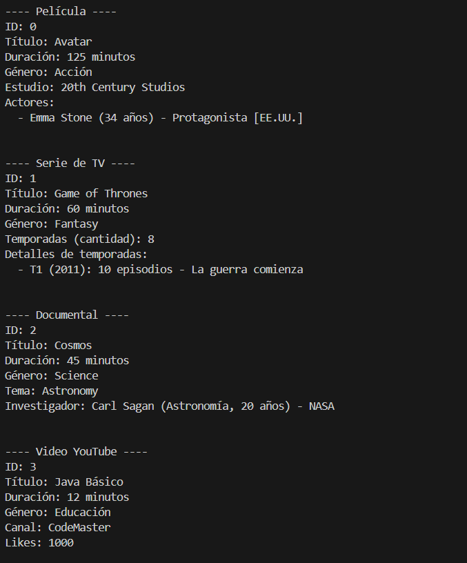

# Ampliación de Contenidos Audiovisuales

**Universidad Politécnica Salesiana**  
**Materia:** Programación Orientada a Objetos  
**Autor:** [Mónica Guillermo]

---

## Objetivo

Este proyecto tiene como objetivo **ampliar y mejorar un sistema en Java aplicando conceptos avanzados de Programación Orientada a Objetos**, como:

- **Herencia**
- **Asociación**
- **Agregación**
- **Composición**

A partir del código base proporcionado en la Unidad 2 (Código Ejemplo 30), que incluye las clases `ContenidoAudiovisual`, `Película`, `SerieDeTV` y `Documental`, se ha trabajado en:

- La creación de nuevas clases (`Actor`, `Temporada`, `Investigador`)
- La creación de subclases (`VideoYouTube`, `Cortometraje`)
- La implementación de relaciones entre clases
- El desarrollo de un sistema funcional y probado
- La elaboración de un diagrama de clases
- Y la gestión completa del proyecto mediante Git y GitHub

---

## Descripción del Proyecto

El sistema permite representar diferentes tipos de contenido audiovisual, como películas, series, documentales, cortometrajes y videos de YouTube.  
Cada tipo hereda de la clase base `ContenidoAudiovisual`, y se relaciona con otras clases como `Actor`, `Temporada` e `Investigador` para simular escenarios reales.

---

## Funcionalidades Nuevas Agregadas

| Clase           | Tipo        | Descripción |
|----------------|-------------|-------------|
| `Actor`        | Asociación  | Relacionada con `Pelicula`, representa actores. |
| `Temporada`    | Composición | Relacionada con `SerieDeTV`, representa temporadas. |
| `Investigador` | Asociación  | Relacionada con `Documental`, representa al investigador principal. |
| `Cortometraje` | Subclase    | Hereda de `ContenidoAudiovisual`, añade el atributo `director`. |
| `VideoYouTube` | Subclase    | Hereda de `ContenidoAudiovisual`, incluye `canal` y `likes`. |

---
## Ejemplo de Ejecución

A continuación, se muestra una captura de pantalla con la salida del programa después de ejecutar el método `main` en `PruebaAudioVisual`:



---

## Instrucciones para Clonar y Ejecutar el Proyecto

### Clonar el repositorio

```bash
git clone https://github.com/tu-usuario/poo_unidad2.git
cd poo_unidad2
